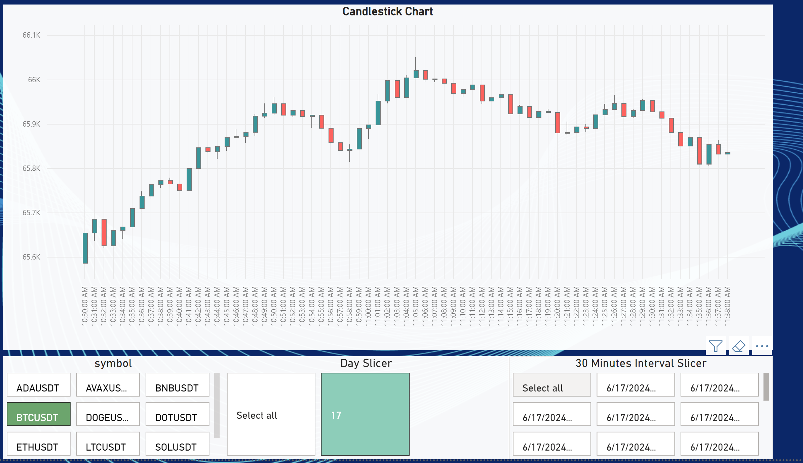
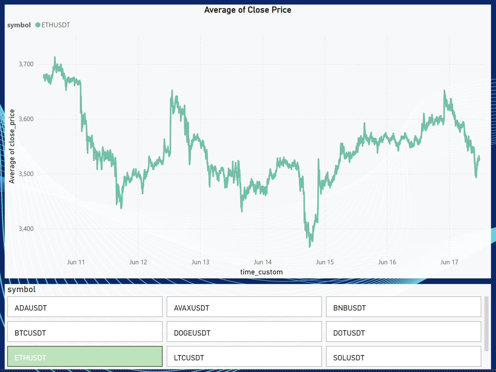
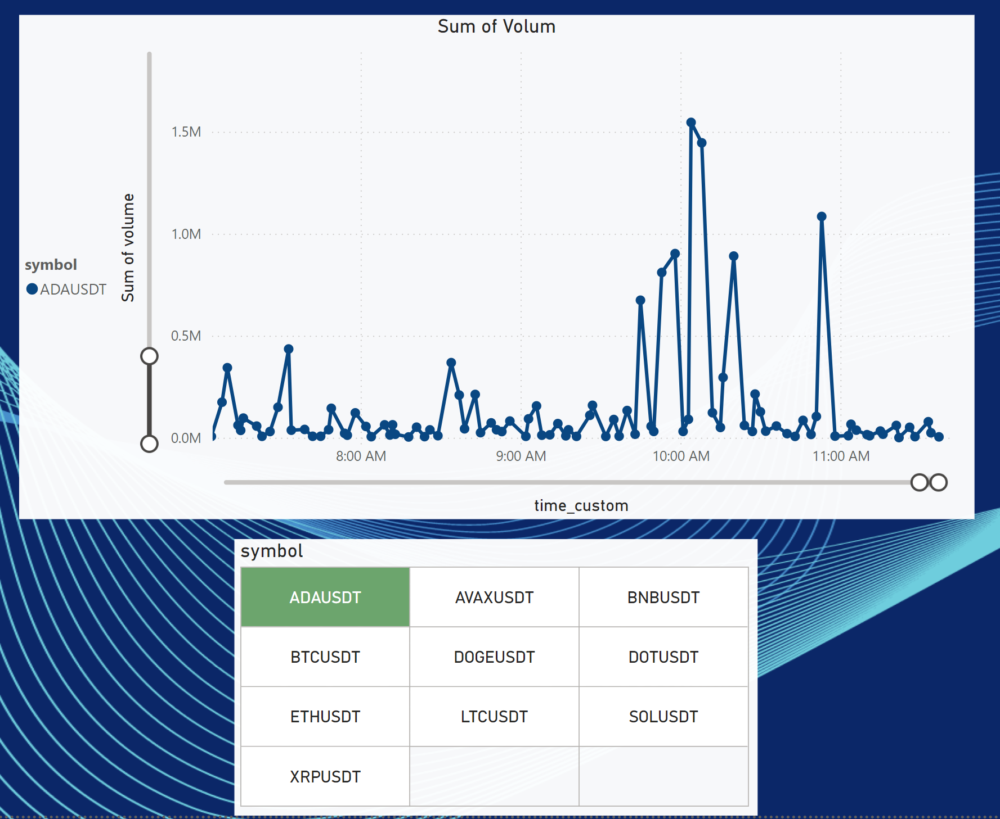

## Stacks

- **Python**: The main programming language used for data collection and manipulation.
- **Binance API**: Used for fetching cryptocurrency candlestick data.
- **PostgreSQL**: The database used for storing the candlestick data.
- **Docker**: Containerization of the application.
- **Docker Compose**: Managing multi-container Docker applications.

## How to Run the Project

1. **Clone the repository**:

    ```sh
    git clone <repository_url>
    cd project_root
    ```

2. **Build and Run the Docker Containers**:

    ```sh
    docker-compose up --build
    ```

3. **Running the Application**:

    The main script `main.py` will be executed, which will fetch historical candlestick data for predefined cryptocurrency pairs and store it in the PostgreSQL database.

## Using Power BI for Data Visualization

### Export Data to Power BI

1. Ensure your PostgreSQL database is accessible and properly configured to allow remote connections.
2. Open Power BI Desktop.
3. Select "Get Data" from the Home ribbon.
4. Choose "PostgreSQL database" from the list of data sources.
5. Enter your database connection details and load the data you want to visualize.
6. Create your reports and dashboards using the loaded data.

### Importing the Exported Power BI Dashboard

1. Locate the exported Power BI dashboard file (`.pbix`) in the `dashboards` directory of the project.
2. Open Power BI Desktop.
3. Click on "File" -> "Open" and navigate to the location of the exported Power BI dashboard file.
4. Select the `.pbix` file and click "Open".
5. The dashboard will open in Power BI Desktop, allowing you to view and interact with the pre-built reports.

### Publishing Reports

1. Once your report is ready, click on the "Publish" button in Power BI Desktop.
2. Choose your workspace in the Power BI service.
3. After publishing, you can view and share your reports and dashboards online.

## Images

Here are some images showing the project in action:




